# 🚨 CrisisConnect AI — Intelligent Emergency Response Platform

<p align="center">
  <b>AI-Powered Emergency Reporting • Intelligent Classification • Real-Time-Style Alerts • Secure Authentication</b>
</p>

<p align="center">
  An AI-powered emergency response platform designed to help hospitality environments report, classify, track, and manage emergency incidents through a conversational workflow.
</p>

<p align="center">


</p>

---

## 🚨 Overview

**CrisisConnect AI** is an AI-powered emergency response platform built to simplify how emergency incidents can be reported, automatically classified, stored, monitored, and resolved.

The system provides a complete workflow:

```text
User
  ↓
Emergency Message
  ↓
React Frontend
  ↓
FastAPI Backend
  ↓
Google Gemini AI
  ↓
Emergency Classification
  ↓
Firebase Firestore
  ↓
Dashboard Alerts
  ↓
Status Management
```

Instead of requiring staff to manually determine the emergency category, the platform uses **Google Gemini** to classify emergency reports into predefined categories:

- 🔥 Fire
- 🏥 Medical
- 🛡️ Security

Each emergency is also assigned a priority according to the implemented classification logic.

---

# 🎯 Problem Statement

Emergency situations in hospitality environments can require quick communication and structured incident management.

A conventional emergency-reporting workflow may involve:

- Manually identifying the emergency type
- Calling or informing responsible staff
- Recording incident details
- Tracking active incidents
- Updating incident status
- Maintaining historical records

This can create delays and inconsistent incident categorization.

CrisisConnect AI addresses this workflow by providing a centralized application where users can submit an emergency message and receive an AI-assisted classification.

---

# 💡 Proposed Solution

CrisisConnect AI provides a simple emergency-reporting interface connected to a FastAPI backend.

The backend sends the emergency message to Google Gemini, which classifies it into one of the supported emergency categories.

The classified emergency is then stored in Firebase Firestore and displayed on the dashboard.

The implemented workflow is:

1. User logs into the application.
2. User submits an emergency message.
3. React sends the request to the FastAPI backend.
4. FastAPI authenticates the request.
5. Gemini analyzes the emergency message.
6. Gemini returns an emergency category.
7. The backend assigns the corresponding priority.
8. The emergency is stored in Firestore.
9. The dashboard retrieves the active alerts.
10. Users can update the emergency status.
11. The dashboard reflects the updated state.

---

# ✨ Key Features

## 🚨 Emergency Reporting

Users can submit an emergency message directly through the dashboard.

Example:

```text
Smoke is coming from the kitchen area.
```

The message is sent to the backend for AI classification.

---

## 🤖 AI Emergency Classification

Google Gemini is used to classify emergency reports.

Supported categories:

| Category | Meaning |
|---|---|
| 🔥 Fire | Fire, smoke, burning, or related incidents |
| 🏥 Medical | Medical emergencies or health-related incidents |
| 🛡️ Security | Security-related incidents and other supported cases |

The backend uses **Gemini 2.5 Flash** as the primary model and contains a fallback configuration for **Gemini 1.5 Flash**.

---

## ⚡ Priority Assignment

After classification, the backend assigns a priority based on the emergency category.

The implemented mapping is:

| Emergency Type | Priority |
|---|---|
| 🔥 Fire | High |
| 🏥 Medical | Medium |
| 🛡️ Security | Low |

This allows alerts to be displayed with a structured priority level.

---

## 📊 Emergency Dashboard

The dashboard provides an overview of reported incidents.

It displays:

- Active emergencies
- Resolved emergencies
- Total emergencies
- Emergency type
- Emergency message
- Priority
- Current status
- Incident information

The dashboard periodically refreshes alert data to provide a real-time-style monitoring experience.

---

## 🔄 Emergency Status Management

Authenticated users can update the status of an emergency.

The implemented workflow supports:

```text
Active
  ↓
Resolved
```

This allows the dashboard to distinguish between ongoing and completed incidents.

---

## 🔐 Authentication

CrisisConnect AI includes authentication using:

- User registration
- User login
- JWT access tokens
- OAuth2 password flow
- bcrypt password hashing
- Protected API endpoints

The frontend stores the authentication token locally and sends it with authenticated API requests.

---

## 🛡️ API Protection

The backend includes rate limiting using SlowAPI.

The backend README specifies a rate limit of:

```text
10 requests / minute / IP
```

This helps reduce excessive API requests.

---

## 🌐 CORS Support

FastAPI is configured with CORS support so that the deployed frontend can communicate with the backend API.

The current configuration is intentionally broad for the hackathon implementation.

For production deployment, the allowed origins should be restricted to trusted frontend domains.

---

## 📝 Logging

The backend uses Loguru for application logging.

Logs are configured with:

- File-based logging
- 1 MB rotation
- 7-day retention

The log file is:

```text
logs/backend.log
```

---

# 🏗️ System Architecture

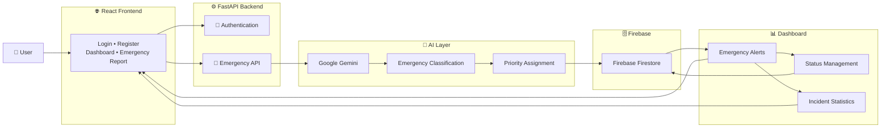

---

# 🔄 Complete End-to-End Workflow

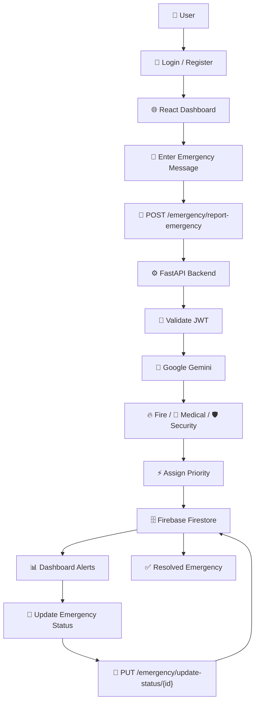

---

# 🤖 AI Classification Pipeline

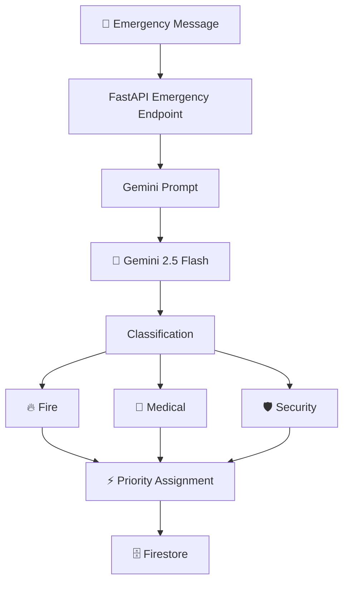

---

# 🔐 Authentication Architecture

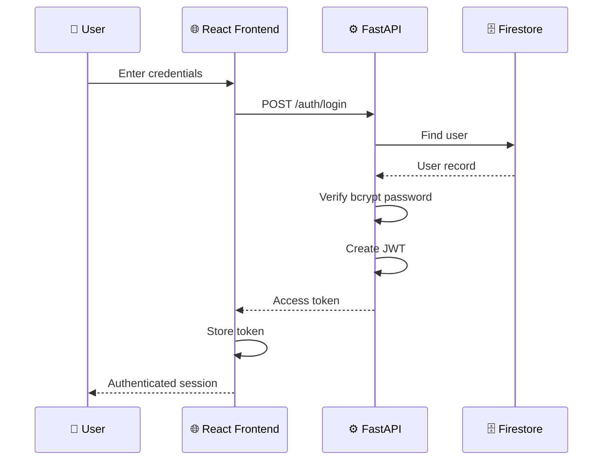

---

# 🚨 Emergency Reporting Sequence

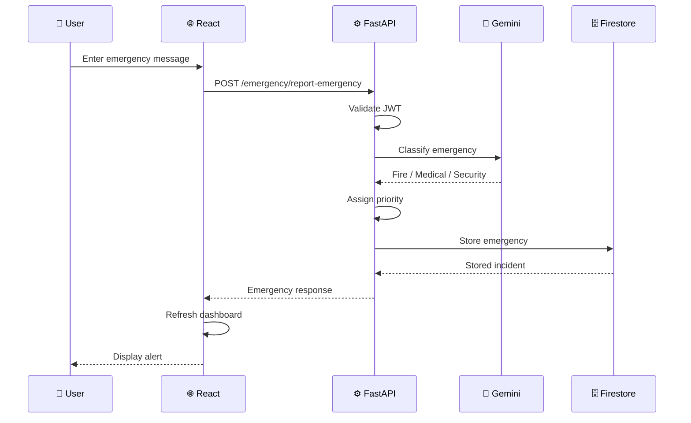

---

# 📊 Dashboard Data Flow

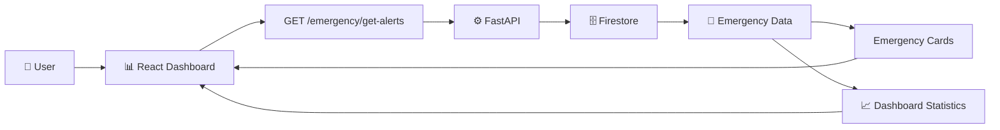

---

# 🧩 Technology Stack

## Frontend

| Technology | Purpose |
|---|---|
| React 19 | User interface |
| TypeScript | Frontend development |
| Vite | Frontend build and development |
| Tailwind CSS | UI styling |
| Axios | API communication |
| React Router | Client-side routing |
| Framer Motion | UI animations |
| Lucide React | Interface icons |
| React Hot Toast | User notifications |

---

## Backend

| Technology | Purpose |
|---|---|
| Python | Backend development |
| FastAPI | REST API framework |
| Uvicorn | ASGI server |
| Pydantic | Data validation |
| Python-JOSE | JWT authentication |
| bcrypt | Password hashing |
| SlowAPI | Rate limiting |
| Loguru | Application logging |
| Python Multipart | Form-data support |

---

## AI

| Technology | Purpose |
|---|---|
| Google Gemini | Emergency classification |
| Gemini 2.5 Flash | Primary classification model |
| Gemini 1.5 Flash | Fallback model |

---

## Database

| Technology | Purpose |
|---|---|
| Firebase Admin SDK | Firebase backend integration |
| Firebase Firestore | Emergency and user data storage |

---

## Deployment

| Technology | Purpose |
|---|---|
| Docker | Backend containerization |
| Google Artifact Registry | Container image storage |
| Google Cloud Run | Backend deployment |
| GitHub Actions | CI/CD automation |

---

# 📁 Project Structure

```text
hack2skill/
│
├── .github/
│   └── workflows/
│       └── deploy.yml
│
├── backend/
│   ├── core/
│   │   ├── config.py
│   │   └── security.py
│   │
│   ├── middleware/
│   │   └── rate_limiter.py
│   │
│   ├── models/
│   │   └── schemas.py
│   │
│   ├── routes/
│   │   ├── auth.py
│   │   └── emergency.py
│   │
│   ├── services/
│   │   ├── db_service.py
│   │   └── gemini_service.py
│   │
│   ├── main.py
│   ├── requirements.txt
│   └── README.md
│
├── crisisconnect-frontend/
│   ├── public/
│   │   ├── _redirects
│   │   ├── favicon.svg
│   │   ├── icons.svg
│   │   └── logo(1).png
│   │
│   ├── src/
│   │   ├── assets/
│   │   │   ├── hero.png
│   │   │   ├── react.svg
│   │   │   └── vite.svg
│   │   │
│   │   ├── components/
│   │   │   ├── EmergencyCard.tsx
│   │   │   └── Navbar.tsx
│   │   │
│   │   ├── context/
│   │   │   ├── AuthContext.tsx
│   │   │   └── auth.ts
│   │   │
│   │   ├── pages/
│   │   │   ├── Dashboard.tsx
│   │   │   ├── Login.tsx
│   │   │   └── Register.tsx
│   │   │
│   │   ├── services/
│   │   │   └── api.ts
│   │   │
│   │   ├── App.css
│   │   ├── App.tsx
│   │   ├── index.css
│   │   └── main.tsx
│   │
│   ├── package.json
│   ├── package-lock.json
│   ├── tailwind.config.js
│   ├── vite.config.ts
│   ├── tsconfig.json
│   ├── tsconfig.app.json
│   └── tsconfig.node.json
│
├── Dockerfile
├── LICENSE
├── README.md
└── package-lock.json
```

---

# ⚙️ Backend Architecture

The backend follows a modular structure.

```text
backend/
│
├── core/
│   ├── config.py
│   └── security.py
│
├── middleware/
│   └── rate_limiter.py
│
├── models/
│   └── schemas.py
│
├── routes/
│   ├── auth.py
│   └── emergency.py
│
├── services/
│   ├── db_service.py
│   └── gemini_service.py
│
└── main.py
```

### `main.py`

The FastAPI application entry point.

Responsibilities include:

- Creating the FastAPI application
- Configuring CORS
- Registering API routers
- Configuring rate limiting
- Configuring logging
- Providing the root health endpoint
- Handling global exceptions

---

# 🔐 Security Layer

## `backend/core/security.py`

The security module handles:

- JWT creation
- JWT validation
- OAuth2 bearer authentication
- Password hashing
- Password verification
- Current-user retrieval

Passwords are stored using bcrypt hashing rather than plain text.

---

# 👤 Authentication API

The authentication router provides:

### Register

```http
POST /auth/register
```

Creates a new user after checking whether the user already exists.

---

### Login

```http
POST /auth/login
```

Authenticates the user and returns a JWT access token.

---

### Current User

```http
GET /auth/me
```

Returns information about the authenticated user.

---

# 🚨 Emergency API

The emergency router provides the core emergency-management functionality.

---

## Report Emergency

```http
POST /emergency/report-emergency
```

Accepts an emergency message and processes it through Gemini.

Example request concept:

```json
{
  "message": "There is smoke coming from the kitchen."
}
```

The backend then:

```text
Message
   ↓
Gemini
   ↓
Classification
   ↓
Priority
   ↓
Firestore
```

---

## Get Alerts

```http
GET /emergency/get-alerts
```

Retrieves emergency alerts for the authenticated user.

Optional filtering is available for:

```text
status
type
```

---

## Update Status

```http
PUT /emergency/update-status/{id}
```

Updates the status of an existing emergency.

---

# 🗄️ Firestore Data Model

Emergency records stored by the backend contain fields such as:

```text
id
type
priority
message
user
timestamp
status
```

Example:

```json
{
  "id": "generated-uuid",
  "type": "Fire",
  "priority": "High",
  "message": "Smoke detected in the kitchen",
  "user": "user@example.com",
  "timestamp": "UTC timestamp",
  "status": "Active"
}
```

---

# 🤖 Gemini Service

The Gemini integration is implemented in:

```text
backend/services/gemini_service.py
```

The service:

1. Loads the Gemini API key.
2. Creates the Gemini client.
3. Sends the emergency classification prompt.
4. Receives the model response.
5. Normalizes the classification.
6. Restricts the output to supported emergency categories.
7. Assigns priority.

Supported categories are:

```text
Fire
Medical
Security
```

---

# ⚡ Priority Logic

The current implementation maps categories as follows:

```text
Fire
  ↓
High

Medical
  ↓
Medium

Security
  ↓
Low
```

This mapping is implemented in the backend rather than generated as an arbitrary model output.

---

# 🌐 Frontend Architecture

The React application uses:

```text
React
   +
TypeScript
   +
Vite
   +
React Router
   +
Axios
```

The main application routes are:

```text
/login
/register
/
```

Protected routes require an authentication token.

---

# 🧭 Frontend Routing

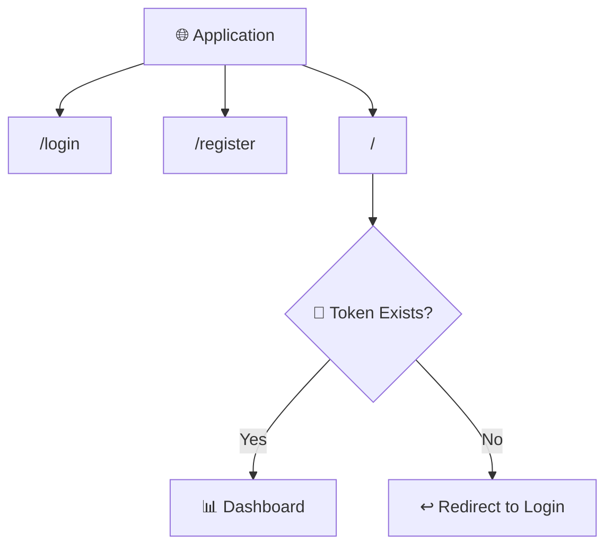

---

# 📊 Dashboard

The dashboard is implemented in:

```text
crisisconnect-frontend/src/pages/Dashboard.tsx
```

The dashboard provides:

- Emergency message input
- Emergency reporting
- Alert retrieval
- Active alert monitoring
- Status updates
- Active count
- Resolved count
- Total count
- Emergency cards

The dashboard polls the alert endpoint periodically to refresh the displayed emergency data.

---

# 🧩 Frontend Components

## `EmergencyCard.tsx`

Displays individual emergency information.

It is used to represent:

- Emergency type
- Priority
- Message
- Status
- Incident actions

---

## `Navbar.tsx`

Provides the application's navigation interface.

---

## `AuthContext.tsx`

Provides frontend authentication state and user-session handling.

---

## `api.ts`

The Axios service layer manages communication between the React application and the FastAPI backend.

It:

- Configures the backend base URL
- Adds the JWT bearer token
- Sends API requests
- Receives backend responses

The API base URL can be configured through:

```env
VITE_API_BASE_URL
```

---

# 🔄 Frontend-to-Backend Communication

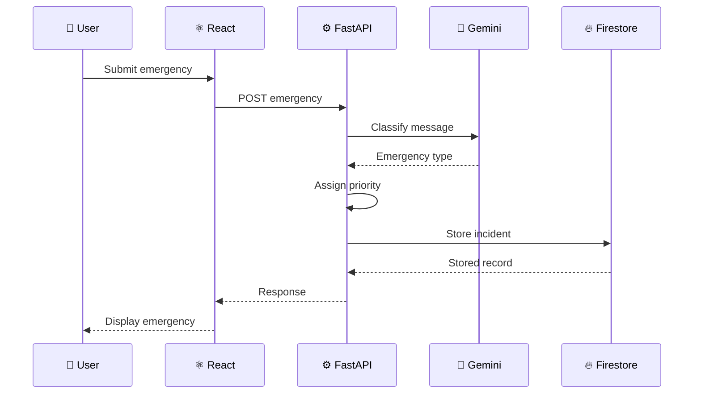

---

# 🐳 Docker

The backend includes a Dockerfile for containerized deployment.

The Docker image uses:

```text
Python 3.11 Slim
```

The container:

1. Installs backend dependencies.
2. Copies the backend application.
3. Creates the log directory.
4. Exposes port `8080`.
5. Starts Uvicorn.

The container starts the application using:

```bash
uvicorn main:app --host 0.0.0.0 --port 8080
```

---

# ☁️ Google Cloud Run Deployment

The backend is configured for Google Cloud Run deployment.

The deployment workflow uses:

```text
GitHub
   ↓
GitHub Actions
   ↓
Docker Build
   ↓
Google Artifact Registry
   ↓
Google Cloud Run
   ↓
CrisisConnect Backend
```

---

# 🚀 Deployment Architecture

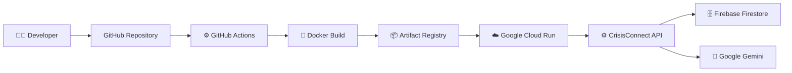

---

# 🔄 CI/CD Pipeline

The repository contains:

```text
.github/workflows/deploy.yml
```

The workflow is triggered when changes are pushed to the main branch.

The deployment process includes:

1. Checkout repository.
2. Authenticate with Google Cloud.
3. Build Docker image.
4. Push image to Artifact Registry.
5. Deploy the backend to Cloud Run.

The workflow uses GitHub repository secrets including:

```text
GCP_PROJECT_ID
GCP_REGION
GCP_SA_KEY
```

---

# 🔐 Security Architecture

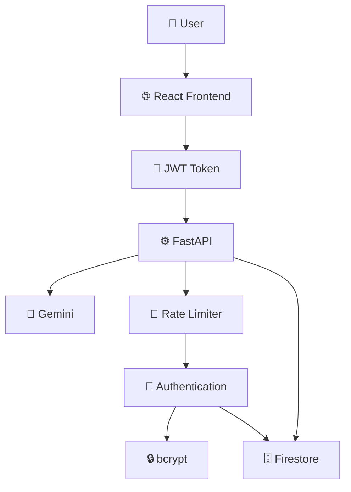

---

# 🛡️ Security Practices

The current implementation includes:

- JWT-based authentication
- bcrypt password hashing
- OAuth2 bearer authentication
- Protected emergency endpoints
- Rate limiting
- Environment-based configuration
- Firebase Admin SDK
- API authentication headers
- Global exception handling

Before production use, additional security hardening should be performed, especially around:

- CORS origin restrictions
- Secret management
- Token configuration
- Database access policies
- Monitoring
- Audit logging

---

# 🧪 Error Handling

The FastAPI backend contains global exception handling.

Unexpected backend errors are handled centrally and return a generic server-error response instead of exposing internal implementation details.

The application also includes logging to support debugging and monitoring.

---

# ⚙️ Environment Configuration

## Backend

Create a `.env` file in the backend environment.

The backend expects configuration values including:

```env
GEMINI_API_KEY=your_gemini_api_key
SECRET_KEY=your_jwt_secret
FIREBASE_CREDENTIALS=your_firebase_credentials
```

The exact configuration is handled by:

```text
backend/core/config.py
```

and the corresponding services.

> Never commit real API keys, JWT secrets, Firebase credentials, or other sensitive values to GitHub.

---

# 📦 Backend Installation

Navigate into the backend directory:

```bash
cd backend
```

Create a virtual environment:

```bash
python -m venv .venv
```

### Windows

```bash
.venv\Scripts\activate
```

### Linux / macOS

```bash
source .venv/bin/activate
```

Install dependencies:

```bash
pip install -r requirements.txt
```

---

# ▶️ Run the Backend

From the `backend` directory:

```bash
uvicorn main:app --reload
```

The FastAPI development server will start locally.

API documentation is available through:

```text
/docs
```

---

# 🌐 Frontend Installation

Navigate to the frontend:

```bash
cd crisisconnect-frontend
```

Install dependencies:

```bash
npm install
```

---

# ▶️ Run the Frontend

Start the Vite development server:

```bash
npm run dev
```

The frontend will provide a local development URL.

---

# 🧪 Frontend Commands

### Development

```bash
npm run dev
```

### Production Build

```bash
npm run build
```

### Lint

```bash
npm run lint
```

### Preview Production Build

```bash
npm run preview
```

---

# 🔗 API Endpoints

| Method | Endpoint | Purpose |
|---|---|---|
| `POST` | `/auth/register` | Register a new user |
| `POST` | `/auth/login` | Authenticate user and receive JWT |
| `GET` | `/auth/me` | Retrieve authenticated user |
| `POST` | `/emergency/report-emergency` | Report and classify an emergency |
| `GET` | `/emergency/get-alerts` | Retrieve emergency alerts |
| `PUT` | `/emergency/update-status/{id}` | Update emergency status |

---

# 📡 API Request Flow

```text
POST /auth/register
        ↓
Create User
        ↓
bcrypt Hash
        ↓
Firestore


POST /auth/login
        ↓
Verify Credentials
        ↓
JWT Token
        ↓
Frontend


POST /emergency/report-emergency
        ↓
JWT Validation
        ↓
Gemini Classification
        ↓
Priority Assignment
        ↓
Firestore
        ↓
Dashboard


GET /emergency/get-alerts
        ↓
JWT Validation
        ↓
Firestore
        ↓
Dashboard


PUT /emergency/update-status/{id}
        ↓
JWT Validation
        ↓
Firestore Update
        ↓
Dashboard
```

---

# 📊 Dashboard Logic

The dashboard maintains three main statistics:

```text
Active Emergencies
Resolved Emergencies
Total Emergencies
```

Conceptually:

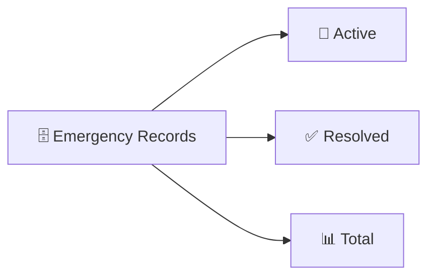

---

# 🎯 Emergency Lifecycle

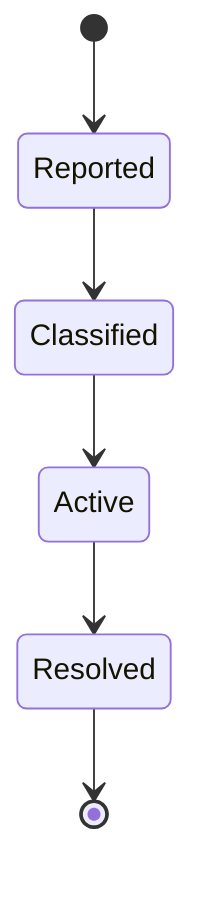

The actual backend stores the emergency with a status value and provides an endpoint for updating that status.

---

# 🧠 Why Gemini?

Google Gemini is used as the AI classification layer because the project requires interpreting free-form emergency messages.

For example:

```text
"There is smoke coming from the kitchen."
```

can be transformed into:

```text
Fire
```

Another example:

```text
"A guest has collapsed and needs immediate assistance."
```

can be classified as:

```text
Medical
```

The application constrains the model output to the supported categories rather than allowing arbitrary emergency labels.

---

# 🏨 Intended Use Case

The backend documentation describes CrisisConnect AI as an emergency response platform for **hospitality environments**.

Potential users include:

- Hotel staff
- Hospitality employees
- Front-desk personnel
- Security teams
- Emergency response teams
- Administrators

The platform is designed around the workflow:

```text
Report
  ↓
Classify
  ↓
Prioritize
  ↓
Store
  ↓
Monitor
  ↓
Resolve
```

---

# 💬 Example Emergency Scenarios

## 🔥 Fire

```text
There is smoke coming from the kitchen.
```

Expected classification:

```text
Fire
```

Priority:

```text
High
```

---

## 🏥 Medical

```text
A guest has collapsed and needs medical assistance.
```

Expected classification:

```text
Medical
```

Priority:

```text
Medium
```

---

## 🛡️ Security

```text
An unauthorized person is attempting to enter a restricted area.
```

Expected classification:

```text
Security
```

Priority:

```text
Low
```

---

# 🧪 Testing Strategy

The application can be tested across several layers.

## Authentication Testing

Test:

- Registration
- Duplicate registration
- Valid login
- Invalid login
- Protected endpoint access
- JWT validation

---

## Emergency Testing

Test:

- Emergency submission
- Gemini classification
- Priority assignment
- Firestore storage
- Alert retrieval
- Status updates

---

## Frontend Testing

Test:

- Login page
- Registration page
- Protected dashboard
- Emergency submission
- Alert display
- Status resolution
- API error handling
- Authentication persistence

---

# 🧱 Architecture Layers

```text
┌─────────────────────────────────────────────┐
│              PRESENTATION                   │
│         React + TypeScript + Vite           │
├─────────────────────────────────────────────┤
│             APPLICATION                    │
│          Axios + React Router               │
├─────────────────────────────────────────────┤
│               API                          │
│                 FastAPI                     │
├─────────────────────────────────────────────┤
│          AUTHENTICATION & SECURITY         │
│       JWT + OAuth2 + bcrypt + SlowAPI       │
├─────────────────────────────────────────────┤
│               AI                           │
│             Google Gemini                   │
├─────────────────────────────────────────────┤
│              DATA                          │
│            Firebase Firestore               │
├─────────────────────────────────────────────┤
│             DEPLOYMENT                     │
│ Docker + Artifact Registry + Cloud Run      │
└─────────────────────────────────────────────┘
```

---

# 🎨 Design Goals

CrisisConnect AI focuses on:

### ⚡ Fast Interaction

Users should be able to report an emergency with minimal interaction.

### 🤖 AI Assistance

Emergency classification is handled automatically through Gemini.

### 📊 Centralized Monitoring

Reported incidents are displayed in a common dashboard.

### 🔐 Secure Access

Authentication and authorization protect emergency-management endpoints.

### 🧩 Modular Architecture

Frontend, backend, AI, database, and deployment components are separated.

### 🚀 Hackathon Demonstrability

The architecture supports a clear end-to-end demonstration:

```text
User
 ↓
Report Emergency
 ↓
AI Classification
 ↓
Priority
 ↓
Database
 ↓
Dashboard
 ↓
Resolve
```

---

# 🧠 Engineering Concepts Demonstrated

Building CrisisConnect AI demonstrates practical experience with:

- REST API development
- FastAPI
- React
- TypeScript
- Vite
- JWT authentication
- OAuth2
- Password hashing
- Firebase Firestore
- Google Gemini
- Prompt-based AI classification
- Rate limiting
- CORS
- Docker
- Google Cloud Run
- GitHub Actions
- CI/CD
- Modular backend architecture
- API integration
- Cloud deployment

---

# 📚 Learning Outcomes

This project provides practical experience in:

- Building a full-stack application
- Designing REST APIs
- Connecting React to FastAPI
- Implementing authentication
- Working with JWT tokens
- Integrating generative AI
- Designing AI classification workflows
- Using Firebase Firestore
- Containerizing applications
- Deploying APIs to Google Cloud
- Building CI/CD pipelines
- Managing frontend/backend communication
- Designing modular application architecture

---

# 🚀 Future Scope

Potential future enhancements include:

- 📱 Mobile application
- 🔔 Push notifications
- 📍 Location-aware emergency detection
- 🗺️ Emergency location mapping
- 👥 Role-based access control
- 🧑‍💼 Dedicated administrator dashboard
- 📊 Advanced emergency analytics
- 📈 Incident history and reporting
- 🧠 Improved AI classification
- 🔄 More emergency categories
- 📞 Integration with emergency services
- 🔔 Automated escalation workflows
- 📡 Real-time event streaming
- 🏨 Multi-hotel support
- 🌐 Multi-language emergency reporting
- 📊 Advanced operational analytics

These are future directions and are not presented as currently implemented functionality.

---

# ⚠️ Current Limitations

CrisisConnect AI is currently a hackathon-oriented implementation.

Important limitations include:

- Gemini classification depends on the configured API and model availability.
- The supported emergency categories are currently limited to Fire, Medical, and Security.
- Priority assignment follows fixed backend logic.
- The dashboard uses periodic polling rather than WebSocket-based real-time communication.
- CORS is broadly configured for the current hackathon setup.
- Firebase credentials and environment configuration must be supplied by the deployment environment.
- The system should not be treated as a replacement for professional emergency services.

---

# 🔬 Project Architecture Summary

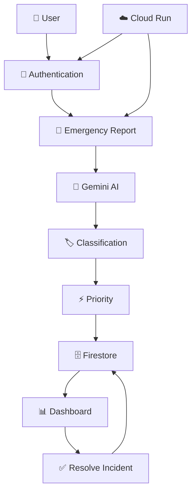

---

# 🏆 Hackathon MVP

The original hackathon plan focused on a minimal working demonstration:

```text
1 Working API
       +
1 AI Classification
       +
1 Dashboard
       +
1 Deployed Backend
```

The current repository extends that foundation with:

- Authentication
- JWT security
- Firestore persistence
- Gemini integration
- Rate limiting
- Logging
- Docker deployment
- Cloud Run deployment
- GitHub Actions CI/CD
- React + TypeScript frontend

---

# 📌 Important Files

| File | Purpose |
|---|---|
| `backend/main.py` | FastAPI application entry point |
| `backend/core/config.py` | Backend configuration |
| `backend/core/security.py` | JWT and password security |
| `backend/models/schemas.py` | Pydantic schemas |
| `backend/routes/auth.py` | Authentication routes |
| `backend/routes/emergency.py` | Emergency routes |
| `backend/services/gemini_service.py` | Gemini AI integration |
| `backend/services/db_service.py` | Firestore operations |
| `backend/middleware/rate_limiter.py` | API rate limiting |
| `crisisconnect-frontend/src/App.tsx` | Frontend routing |
| `crisisconnect-frontend/src/pages/Dashboard.tsx` | Main dashboard |
| `crisisconnect-frontend/src/pages/Login.tsx` | Login page |
| `crisisconnect-frontend/src/pages/Register.tsx` | Registration page |
| `crisisconnect-frontend/src/components/EmergencyCard.tsx` | Emergency display component |
| `crisisconnect-frontend/src/services/api.ts` | Axios API service |
| `Dockerfile` | Backend container configuration |
| `.github/workflows/deploy.yml` | Cloud deployment workflow |

---

# 📦 Backend Dependencies

The backend uses:

```text
fastapi
uvicorn
firebase-admin
python-dotenv
slowapi
python-jose
bcrypt
pydantic
loguru
python-multipart
google-genai
```

Install them with:

```bash
pip install -r backend/requirements.txt
```

---

# 📦 Frontend Dependencies

The frontend uses:

```text
react
react-dom
react-router-dom
axios
framer-motion
lucide-react
react-hot-toast
```

Development tooling includes:

```text
typescript
vite
tailwindcss
eslint
```

Install them with:

```bash
cd crisisconnect-frontend
npm install
```

---

# 🔗 Backend and Frontend Integration

The frontend communicates with the FastAPI backend through Axios.

The API service uses:

```env
VITE_API_BASE_URL
```

If the environment variable is not provided, the current frontend contains a deployed Cloud Run backend URL as its fallback configuration.

For local development, configure:

```env
VITE_API_BASE_URL=http://localhost:8000
```

according to your local backend configuration.

---

# 🧭 Quick Architecture View

```text
                    👤 USER
                       │
                       ▼
             ┌──────────────────┐
             │   React Frontend │
             │ TypeScript + Vite│
             └────────┬─────────┘
                      │
                      ▼
             ┌──────────────────┐
             │   FastAPI API    │
             └────────┬─────────┘
                      │
          ┌───────────┼───────────┐
          │           │           │
          ▼           ▼           ▼
      🔐 Auth      🤖 Gemini    🚦 Rate Limit
          │           │
          │           ▼
          │      🏷️ Classification
          │           │
          │           ▼
          │      ⚡ Priority
          │           │
          └──────┬────┘
                 ▼
          🗄️ Firebase
            Firestore
                 │
                 ▼
          📊 Dashboard
                 │
                 ▼
          ✅ Status Update
```

---

# 🌟 Project Vision

CrisisConnect AI demonstrates how artificial intelligence can be integrated into an emergency-management workflow to reduce manual classification and provide a structured incident-monitoring experience.

The core concept is:

```text
Natural-Language Emergency
            ↓
       AI Classification
            ↓
        Prioritization
            ↓
      Structured Storage
            ↓
      Dashboard Monitoring
            ↓
       Status Management
```

The project combines **AI, full-stack development, cloud services, authentication, database systems, and deployment automation** into a single end-to-end application.

---

# 👨‍💻 Author

**Meganath M**

CSE (AI & ML)  
AI/ML Developer • Full-Stack Builder • Robotics Explorer

GitHub:  
https://github.com/meganathm123-lgtm

LinkedIn:  
https://www.linkedin.com/in/meganathmadurai12

---

# 📄 License

This project is licensed under the **MIT License**.

See the `LICENSE` file for more information.

---

<p align="center">
  🚨 <b>CrisisConnect AI</b> — Report. Classify. Prioritize. Resolve.
</p>

<p align="center">
  Built with React • TypeScript • FastAPI • Gemini • Firebase • Docker • Google Cloud
</p>
